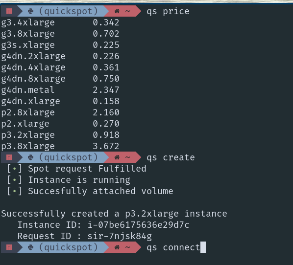

# Quickspot

Deploy spot instances (one-time) from the command line



#### Simple workflow

Quickspot has flexible config files that allow you to create and connect to multiple spot-instances. For a user that is going to be using a single spot instance at any point of time, below is a simple workflow

* Configure `~/.config/aws/config.json` and `~/.config/aws/global_config.json`
* Execute `qs create` to create a spot instance
* `qs connect` to connect to the instance 
* `qs list` to the list set of running instances.
* From the EC2-instance, run `sudo shutdown -h now` to terminate the spot instance. 

## Installation

```bash
$ pip install appdirs==1.4.4
$ pip install git+https://github.com/rahul13ramesh/quickspot.git
```


## Setup

* Fetch the `AWS_ACCESS_KEY_ID` and `AWS_SECRET_ACCESS_KEY` from the [IAM
  console](https://console.aws.amazon.com/iam/home?#/security_credentials})
* Setup credentials and the default zone for `boto3` ([guide](https://boto3.amazonaws.com/v1/documentation/api/latest/guide/quickstart.html))
* Configure `~/.config/aws/global_config.json` (global config applied to all
  instances). The `KeyName` is the name of the private
  key on AWS while `pem-file` is the path to the file on your machine. `tags`
  will be applied to every instance your create.
```json
{ 
    "aws_access_key_id": "AWS_ACCESS_KEY_ID",
    "aws_secret_access_key": "AWS_SECRETE_ACCESS_KEY",
    "pem-file": "~/.ssh/rahul-laptop", 
    "KeyName": "rahul-laptop",
    "tags": [
        {
            "Key": "owner",
            "Value": "rahul"
        }
    ],
    "defaultConfig": "config.json"
}
```

* Configure `~/.config/aws/config.json` (instance specific config) from the
  command line. `volume-id` is the external volume you would like to attach.
  Set it to `None` if you would like to attach no volume. ``tags`` are applied
  to only the specific instance created using this configuration file. Supply
  an empty array if you would like no such tags to be applied

```json
{
    "ImageId": "ami-0123450012ea098da",
    "InstanceType": "g4dn.xlarge",
    "KeyName": "rahul-laptop",
    "SecurityGroupIds": [ "sg-0abscdsfsafas" ],
    "Placement": {
            "AvailabilityZone": "us-east-1b"
    },
    "volume-id": "vol-00abscsdfgsasfdasfd",
    "tags": [{
        "Key": "Name",
        "Value": "machine1-g4dn-b"
    }]
}
```

## Usage

```bash

Usage:
  qs create   [<config_file>]
  qs connect  [<Name_tag>]
  qs copyto   [<Name_tag>]  --src=<src_file> --dst=<dest_file>
  qs copyfrom [<Name_tag>]  --src=<src_file> --dst=<dest_file>
  qs list
  qs price
  qs (-h | --help)

Arguments:
  list           List Instances
  connect        Connect to an active instance
  attach         Attach a volume
  create         Create a new spot instance request
  copyto         Copy from local to EC2 instance
  copyfrom       Copy from EC2 instance to local machine

Options:
  -h, --help     Show this screen.
```

#### Create
Note that `qs create` will default to using `~/.config/aws/config.json`. You
can use another config files as follows:
* Add a file to `~/.config/aws/` (For example `~/.config/aws/config_machine2.json`)
* Call `qs create config_machine2`
* Make sure to add the tag "Name". This can be used with the `connect`, to specify the instance to which you want to connect to.

#### Connect
Note that `qs connect` will connect to one of the running instance. To connect
to a specific instance, consider using `qs connect <Name tag>`, where the name
tag is specified in the associated config file (The "Tags" field in  `~/.config/aws/config.json`)

#### Shutting down instance
Run the following, from the command line of the ec2-instance
```bash
sudo shutdown -h now
```


